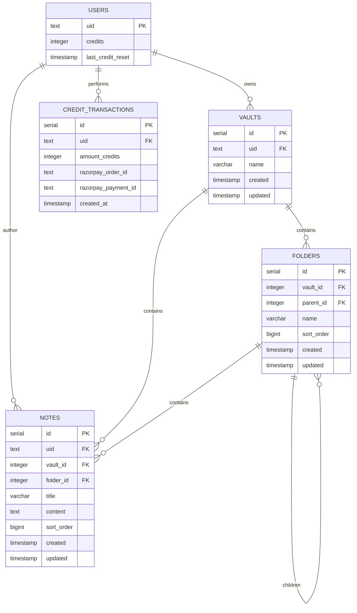

# Cognia RDBMS Documentation

This document provides a comprehensive overview of the Relational Database Management System (RDBMS) used by Cognia.

## Overview
Cognia uses **PostgreSQL** as its primary data store. The database is designed with a hierarchical structure to manage users, vaults, folders, and notes efficiently.

## Connection Details
- **Database Name**: `cognia`
- **Host**: `localhost`
- **Port**: `5432`
- **User**: `postgres`

## Entity Relationship Diagram (ERD)

## Tables Reference

### `users`
Stores user profile information and credit balance.
| Column | Type | Constraints | Description |
| :--- | :--- | :--- | :--- |
| `uid` | `TEXT` | `PRIMARY KEY` | Unique identifier (Firebase UID). |
| `credits` | `INTEGER` | `DEFAULT 50` | User's current credit balance. |
| `last_credit_reset` | `TIMESTAMP` | `DEFAULT NOW()` | Last time the user's credits were reset (monthly reset). |

### `vaults`
Top-level containers for organizing notes and folders.
| Column | Type | Constraints | Description |
| :--- | :--- | :--- | :--- |
| `id` | `SERIAL` | `PRIMARY KEY` | Unique vault ID. |
| `uid` | `TEXT` | `REFERENCES users(uid)` | Owner of the vault. |
| `name` | `VARCHAR(255)`| `NOT NULL` | Name of the vault. |
| `created` | `TIMESTAMP` | `DEFAULT NOW()` | Creation timestamp. |
| `updated` | `TIMESTAMP` | `DEFAULT NOW()` | Last modification timestamp. |

### `folders`
Hierarchical containers within a vault.
| Column | Type | Constraints | Description |
| :--- | :--- | :--- | :--- |
| `id` | `SERIAL` | `PRIMARY KEY` | Unique folder ID. |
| `vault_id` | `INTEGER` | `REFERENCES vaults(id)` | Parent vault. |
| `parent_id` | `INTEGER` | `REFERENCES folders(id)`| Parent folder (Recursive relationship). |
| `name` | `VARCHAR(255)`| `NOT NULL` | Folder name. |
| `sort_order`| `BIGINT` | `DEFAULT 0` | Ordering index for UI. |
| `created` | `TIMESTAMP` | `DEFAULT NOW()` | Creation timestamp. |
| `updated` | `TIMESTAMP` | `DEFAULT NOW()` | Last modification timestamp. |

### `notes`
The core content entity.
| Column | Type | Constraints | Description |
| :--- | :--- | :--- | :--- |
| `id` | `SERIAL` | `PRIMARY KEY` | Unique note ID. |
| `uid` | `TEXT` | `REFERENCES users(uid)` | Author of the note. |
| `vault_id` | `INTEGER` | `REFERENCES vaults(id)` | Parent vault. |
| `folder_id` | `INTEGER` | `REFERENCES folders(id)`| Parent folder (Nullable for root notes). |
| `title` | `VARCHAR(255)`| `NOT NULL` | Note title. |
| `content` | `TEXT` | | Note content (HTML/JSON string). |
| `sort_order`| `BIGINT` | `DEFAULT 0` | Ordering index for UI. |
| `created` | `TIMESTAMP` | `DEFAULT NOW()` | Creation timestamp. |
| `updated` | `TIMESTAMP` | `DEFAULT NOW()` | Last modification timestamp. |

### `credit_transactions`
History of credit purchases.
| Column | Type | Constraints | Description |
| :--- | :--- | :--- | :--- |
| `id` | `SERIAL` | `PRIMARY KEY` | Transaction ID. |
| `uid` | `TEXT` | `REFERENCES users(uid)` | User who made the transaction. |
| `amount_credits`| `INTEGER` | `NOT NULL` | Credits purchased. |
| `razorpay_order_id`| `TEXT` | | Razorpay order reference. |
| `razorpay_payment_id`| `TEXT` | | Razorpay payment reference. |
| `created_at` | `TIMESTAMP` | `DEFAULT NOW()` | Transaction timestamp. |

## Indexes
- `idx_folders_vault_id`: Optimizes folder retrieval by vault.
- `idx_notes_vault_id`: Optimizes note retrieval by vault.
- `idx_notes_folder_id`: Optimizes note retrieval by folder.

## Key Logic

### Credit Reset Mechanism
Users start with 50 credits. Credits are reset to 5 if the last reset was more than 30 days ago, implemented in the `getOrInitUser` function.

### Reordering
A global reordering endpoint (`/reorder`) handles batch updates of `sort_order` for both folders and notes within a transaction to maintain UI consistency during drag-and-drop operations.
